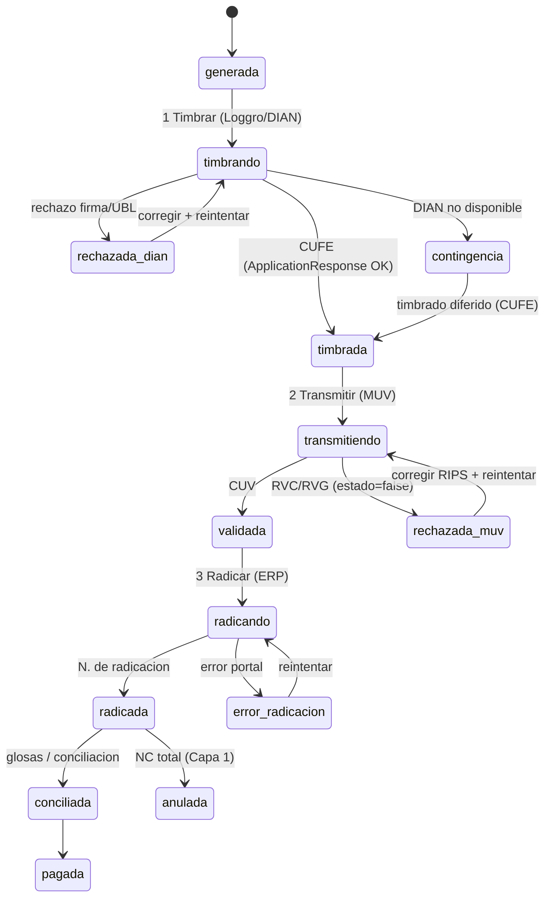

# Ciclo de vida de la FEV — estados y operaciones asíncronas

> [!abstract] Qué es
> El mapa correcto del ciclo de una factura electrónica en salud. Corrige un modelo ingenuo (transiciones instantáneas): **cada paso hacia adelante es una llamada a un servicio externo — asíncrona, con latencia y resultado (éxito o rechazo)**. Fundamentado en Lineamientos v3.2, manual API Docker del MUV, y la API de Loggro. Es el sustrato sobre el que se emiten las [[Notas crédito y débito (NC · ND) — flujo, campos y reglas|NC/ND]].

## Principio: dos ejes
No basta un `estado` string. Se modela con **dos ejes independientes**:
- **A · Estado del documento** (persistente, contable): dónde está la factura en el ciclo.
- **B · Estado de la operación** (efímero, por transición): `idle → enviando/esperando` (**loading**) → `ok | error`. Es el que produce los *loading states* y las ramas de rechazo.

Mezclarlos (lo que hacía el prototipo al inicio) da un flujo irreal, sin carga ni errores.

## Diagrama de estados

Los estados en gerundio (`timbrando`, `transmitiendo`, `radicando`) son los **in-flight / loading**; los rojos (`rechazada_dian`, `rechazada_muv`, `error_radicacion`, `contingencia`) son ramas de excepción.

## Operaciones (llamada externa · loading · éxito · error)
| # | Operación | Servicio / método | Loading (fases) | Éxito | Rechazo |
|---|---|---|---|---|---|
| 1 | **Timbrar** | Loggro → DIAN (`generarDocumentoElectronicoXML`; acuse por consulta) | *Firmando y enviando a la DIAN… → Esperando validación previa (CUFE)…* | `timbrada` + **CUFE** (ApplicationResponse OK) | `rechazada_dian` (firma/UBL) · o `contingencia` si la DIAN no responde |
| 2 | **Transmitir** | MUV MinSalud (`LoginSISPRO` → `CargarFevRips`/`CargarNC…` → `ConsultarCUV`) | *Autenticando… → Transmitiendo {FEV+RIPS}… → Validando contra BDUA/RETHUS/MIPRES…* | `validada` + **CUV** | `rechazada_muv`: `estado de transacción=false` + `ResultadosValidacion.Observaciones` (RVC/RVG) |
| 3 | **Radicar** | Portal/API de la ERP | *Radicando la cuenta ante la ERP…* | `radicada` + N.º radicación | `error_radicacion` |

## Reglas del mapeo (verificadas)
- **Asíncrono, no inmediato:** el resultado se **consulta** (`ConsultarCUV`, consulta de acuse DIAN). La UI debe mostrar **loading** con el mensaje del paso y **deshabilitar** la acción mientras corre.
- **Reanudable / idempotente:** si el proceso se interrumpe, al volver se **consulta el estado** — **no se reenvía** (evita duplicados en DIAN/MUV).
- **Rechazos de primer nivel:** DIAN y MUV **rechazan**; hay que mostrar el motivo real (ApplicationResponse / Observaciones RVC) y ofrecer **corregir + reintentar** (con **tope de reintentos**, flujo 3.1).
- **Contingencia (Cap. 6):** DIAN no disponible → **numeración de contingencia** (factura tipo 03) → **timbrado diferido** al restablecerse.
- **Delegación parcial:** paso 1 (CUFE) = pierna **Loggro**; paso 2 (CUV) = pierna de **salud de la app**. Ver [[Loggro — API de facturación electrónica]].
- **Bitácora:** cada transición registra actor · timestamp · resultado · CUFE/CUV ([[Modelo de persistencia (fusión P0 · Fase 5 · P3)|§2.6]]).

## Estado en el prototipo (2026-07-22)
Implementado en `prototipo-convenio-contrato-orden.html` (Capa 0): máquina de dos ejes (`OPS` + `iniciarOp`), loading simulado con latencia, ramas de rechazo/contingencia, reintentos y un **conmutador "simular próximo envío"** (Éxito / Rechazo / DIAN no disponible). Verificado con mock DOM headless. Pendiente: reintentos con tope, notificación async real, `conciliada`/`pagada`.

## Fuentes
- **Lineamientos técnicos v3.2** (proceso general, validación previa DIAN, dos momentos MUV, Cap. 6 Contingencia).
- **Manual API Docker MUV** (`LoginSISPRO`, `CargarFevRips`, `ConsultarCUV`, `estado de transacción`, `ResultadosValidacion.Observaciones`).
- **Loggro** (`generarDocumentoElectronicoXML`, acuse/CUFE por consulta) → [[Loggro — API de facturación electrónica]].
